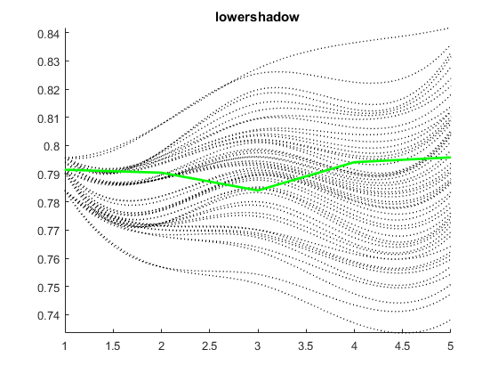
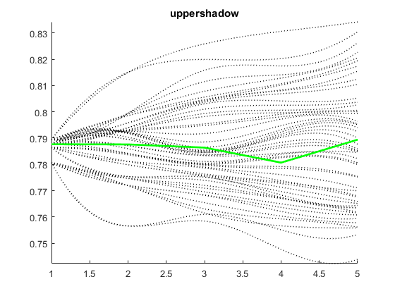
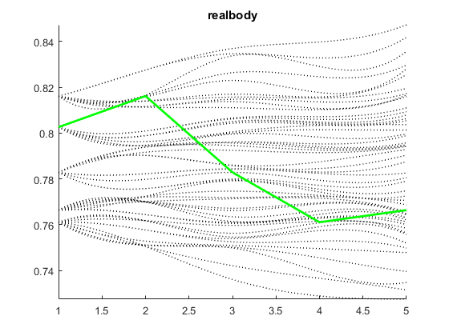
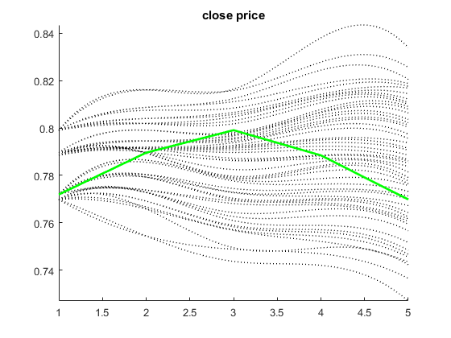
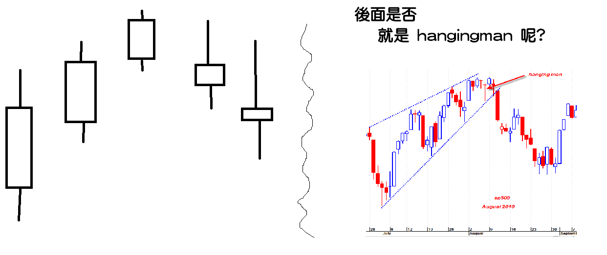
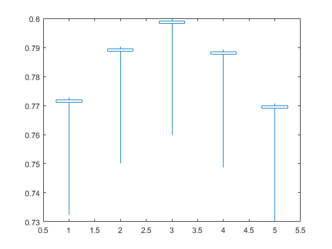

# hangingman filter 特徵提取

## 使用方法

1. 從 script.py 提取 pkl 的 filter 存成 csv
2. 從 matlab 中執行 main 跑出圖

## 目前結果 

> 這主要是示範給大家看，怎麼解讀 kernel 反推的 feature

由於 lower shadow 與 upper shadow 和 real body 是分開來 normalzie

所以很難判斷原本的價格型態的開高低收(OHLC)的特徵

可以在和 price 跑一次, 看看 fit 高的時候是什麼樣的情況

---

上圖可以觀察 lower shadow 會呈現一種先降反升的情況

也就是下影線應該會變短，然後變長

黑色線是各種反推特徵可能的組合的 Q1-Q50 (50分位數)

看起來在第三個 bar 和 key feature 不太一樣 (key feature詳見main中定義)

upper shadow 也是一樣，但是在分位數有兩種趨勢

一個是向上走直接慢慢上影線越拉越長

另一種是上影線出來，然後在第三個 bar 又變小，在第五個 bar 又變高

real body 在 key feature 是急遽減小，就是 body 會變得很小

但是在分位數反推沒有那麼明顯，所以 real body 可能不太能代表什麼

不夠一致

close price 是蠻清楚的，就是一個價格在 5 個 bar 呈現反轉的情況

在 50 分位數上面看起來大概在 4, 5 bar 是一致的

但是在前面感覺還好

## 小結

我覺得分位數不夠和 key feature 一致，代表說你的 kernel 沒辦法存到我們觀察的到的資訊

不代表 kernel 沒用，但我們觀察不到

這有兩種解決辦法，一種是對資料 normalize 到更小的 range
例如 [0.25 0.75] 

或是另一種加大 kernel size

照我們前面的推論，這個型態的特徵應該長得有點像：

但是由於 normalize 可以控制，所以我們這樣反推也不太正確，他也有可能長得像

總之，就再深入研究吧

Ricky at 2017.10.19